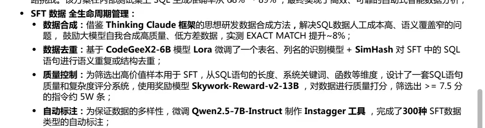

聊天记录：
~transformer，几个变体 
~decode only，类gpt模型
~deepseek qwen 模型迭代的改进点
~用llamafactory框架微调lora 几个模型
~推理加速框架的使用  vllm sglang，原理看看
～native rag ，手搓一下，langchain llamaindex这两个框架优先。然后graphrag也要看看，简历上这个graphrag或者agentic rag

agent的话，很考验人[Facepalm]我觉得我agent项目走偏了，技术性太强，从钱的角度看，成本很高，然后收益不多。有人会质疑我项目真实性
agent的话，用langgraph就好搭就好，然后面试可能有人问会不会dify，也可以玩一玩
我是text2sql agent，智能问数，工程量很大
我这个智能问数，偶尔有人喜欢，偶尔有人质疑，比如创维酷开面试官就很傻逼，说"我从不相信text2sql这个东西，我认为这个领域不应该存在，也不必要花这么大功夫"，两轮面试都在和我吵架，然后还让我进三面

大胆写吧 三个项目
rag agent 训练
老师是有帮我们一个一个改简历的
